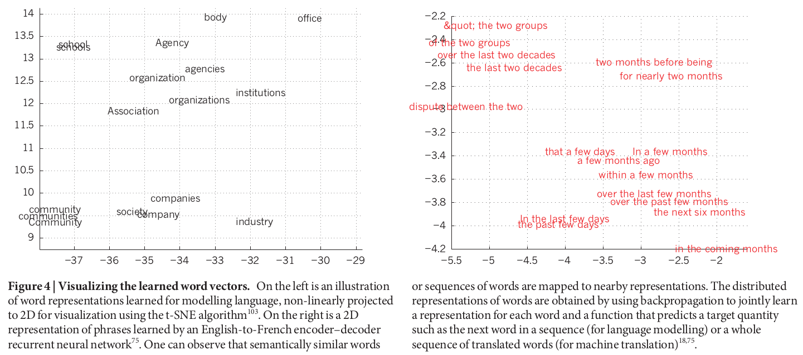
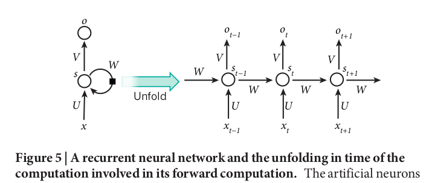

# Deep learning
> Author: Yann LeCun, Yoshua Bengio & Geoffrey Hinton  
> Journal: Nature  
> Year: 2015  
> [Source paper link](http://www.cs.toronto.edu/~hinton/absps/NatureDeepReview.pdf)

- [Deep learning](#deep-learning)
  - [Abstract](#abstract)
  - [Introduction](#introduction)
    - [Why deep learning?](#why-deep-learning)
    - [What is deep learning?](#what-is-deep-learning)
  - [Supervised learning](#supervised-learning)
    - [The learning progress of supervised learning](#the-learning-progress-of-supervised-learning)
    - [The shallow classifier's incapabilities](#the-shallow-classifiers-incapabilities)
  - [Backpropagation to train multilayer architectures](#backpropagation-to-train-multilayer-architectures)
    - [The mechanism of backpropagation](#the-mechanism-of-backpropagation)
    - [Why a 1980s method gets its revival after 2006?](#why-a-1980s-method-gets-its-revival-after-2006)
  - [Convolutional neural networks](#convolutional-neural-networks)
    - [Parameter sharing rules for convolutional layers](#parameter-sharing-rules-for-convolutional-layers)
    - [The function of Pooling layers](#the-function-of-pooling-layers)
  - [Image understanding with deep convolutional networks](#image-understanding-with-deep-convolutional-networks)
  - [Distributed representations and language processing](#distributed-representations-and-language-processing)
  - [Recurrent neural networks](#recurrent-neural-networks)
  - [The future of deep learning](#the-future-of-deep-learning)

## Abstract
Two key sentences:
1. Deep learning allows computational models that are composed of **multiple processing layers** to **learn representations of data** with multiple levels of abstraction.
2. Deep learning discovers intricate structure in large data sets by using the **backpropagation algorithm** to indicate how a machine should **change its internal parameters** that are used to compute the representation in each layer from the representation in the previous layer.

## Introduction
### Why deep learning?
For decades, conventional machine-learning techniques were limited in their ability to process natural data in their raw form. While deep learning models are **end-to-end**, which means it's able to find the intricate structures in data **without the help of human engineers**.

### What is deep learning?
Deep-learning methods are **representation-learning** methods with multiple levels of representation, obtained by composing simple but non-linear modules that each transform the representation at one level (starting with the raw input) into a representation at a higher, slightly more abstract level.

## Supervised learning
### The learning progress of supervised learning
1. **Forward propagation.** During training, the machine is shown an image and produces an output in the form of a vector of scores, one for each category.
2. **Compute the error.** Compute an objective function that measures the error (or distance) between the output scores and the desired pattern of scores. 
3. **Back propagation.** The machine then modifies its internal adjustable parameters (called 'weights') to reduce this error.

### The shallow classifier's incapabilities
For **shallow classifiers**, there exists the **selectivity–invariance
dilemma** -- one that produces representations that are selective to
the aspects of the image that are important for discrimination, but
that are invariant to irrelevant aspects such as the pose of the animal.  
Though more powerful classifiers can be built using **generic non-linear features**, as with kernel methods, it still possess the problem of **bad generalization**.  
> That's where deep learning methods come in!

## Backpropagation to train multilayer architectures
### The mechanism of backpropagation
> Quote: The backpropagation procedure to compute the gradient of an objective function with respect to the weights of a multilayer stack of modules is nothing more than a practical application of the chain rule for derivatives.

> Figure b. Chain rules for derivatives  
> Figure c. Forward propagation  
> Figure d. Backpropagation

### Why a 1980s method gets its revival after 2006?
- CIFAR's innovative methods to get sensible initialized weights so that BP could become feasible for deep system.
- The advent of fast graphics processing units (GPUs)

## Convolutional neural networks
> Born in 1990s.  
> Four key ideas behind ConvNets: **local connections**, **shared weights**, **pooling** and **the use of many layers**.  

### Parameter sharing rules for convolutional layers
**Rules**
- All units in a feature map share the same filter bank.
- Different feature maps in a layer use different filter banks.
  
**Ideas behind the rules**
- In array data such as images, local groups of values are often highly correlated, forming distinctive local motifs that are easily detected.
- The local statistics of images and other signals are invariant to location.

### The function of Pooling layers
The role of the pooling layer is to **merge semantically similar features into one**, creating an **invariance** to small shifts and distortions.

## Image understanding with deep convolutional networks
> Some application of ConvNets.

## Distributed representations and language processing
In language processing tasks, words are expressed in distributed representations when using deep learning models, which is stonger both in **generalization** and **capacity** as opposed to classic learning algorithms. And more importantly, distributed representation makes **semantically related words end up close to each other** in the vector space.

## Recurrent neural networks
Recurrent neural networks (RNNs) are intended for **sequential inputs**. RNNs process an input sequence one element at a time, maintaining in their hidden units a ‘state vector’ that implicitly contains information about the history of all the past elements of the sequence.  
Once unfolded in time, RNN can be seen as very deep feedforward networks in which all the layers share the same weights.

To correct its **difficulty to store long term information**, many proposals have been made to augment RNNs with a memory module. Typycal ones are **long short-term memory (LSTM)**, neural Turning machine and memory networks.

## The future of deep learning
**Several prophecies**
1. **Unsupervised learning** will become far more important in the longer term.
2. The future progress in **vision** will come from systems that are trained end-to-end and combine ConvNets with RNNs that use reinforcement learning to decide where to look.
3. **Natural language understanding** will be enhanced much better by RNNs when they learn strategies for selectively attending to one part at a time.
4. Major progress in **artificial intelligence** will come about through systems that combine representation learning with complex reasoning.