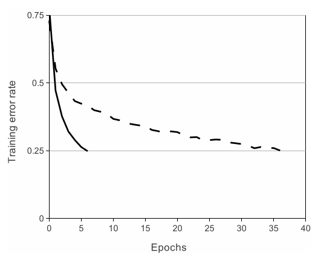
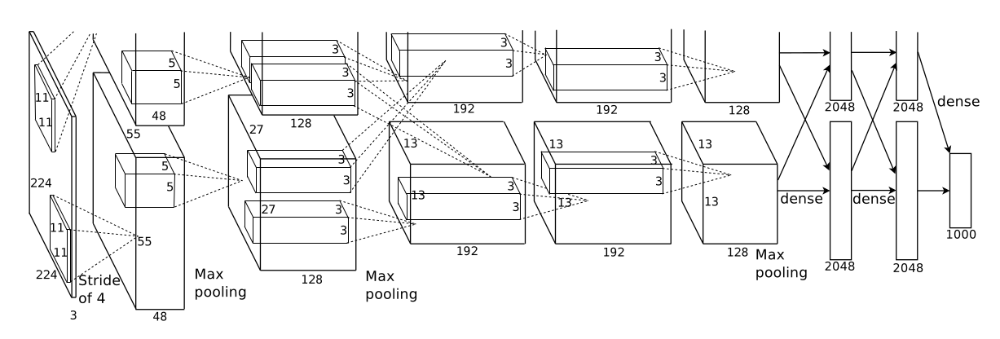
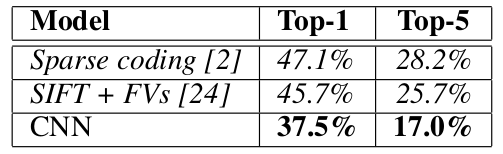
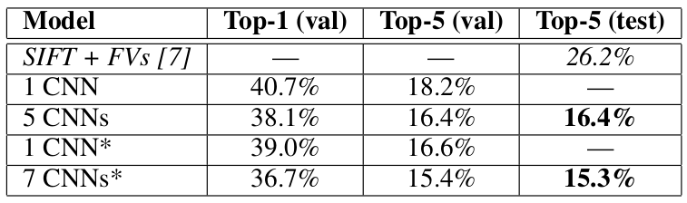

# ImageNet Classification with Deep Convolutional Neural Networks
> Author: Alex Krizhevsky, Ilya Sutskever, Geoffrey E. Hinton  
> Journal: Advances in neural information processing systems  
> Year: 2012  
> [Source paper link](https://proceedings.neurips.cc/paper/2012/file/c399862d3b9d6b76c8436e924a68c45b-Paper.pdf)

- [ImageNet Classification with Deep Convolutional Neural Networks](#imagenet-classification-with-deep-convolutional-neural-networks)
  - [Abstract](#abstract)
  - [1 Introduction](#1-introduction)
  - [2 The Dataset](#2-the-dataset)
  - [3 The Architecture](#3-the-architecture)
    - [3.1 ReLU Nonlinearity](#31-relu-nonlinearity)
    - [3.2 Training on Multiple GPUs](#32-training-on-multiple-gpus)
    - [3.3 Local Response Normalization](#33-local-response-normalization)
    - [3.4 Overlapping Pooling](#34-overlapping-pooling)
    - [3.5 Overall Architecture](#35-overall-architecture)
  - [4 Reducing Overfitting](#4-reducing-overfitting)
    - [4.1 Data Augmentation](#41-data-augmentation)
    - [4.2 Dropout](#42-dropout)
  - [5 Details of learning](#5-details-of-learning)
  - [6 Results](#6-results)
    - [6.1 Qualitative Evaluations](#61-qualitative-evaluations)
  - [7 Discussion](#7-discussion)

## Abstract 
**Model**: 5Conv(some followed by max-pooling) + 3FC(with dropout) + softmax, 650,000 neurons, 60 million parameters  
**Performance**: 
- ImageNet LSVRC-2010
  - top-1 error rate: 37.5%
  - top-5 error rate: 17.0%
- ImageNet ILSVRC-2012 (using a variant of the model)
  - top-5 error rate: 15.3%

## 1 Introduction
To learn about thousands of objects from millions of images, **large learning capacity** is not enough. Lots of **prior knowledge** are needed to compensate for all the data we don’t have.  
In CNN, such prior knowledge are stationarity of statistics and locality of pixel dependencies.

## 2 The Dataset
**Preprocessing**  
1. Down-sample the images to 256 × 256. For rectangular image, rescale shorter side to 256 and then cropped out the central 256×256 patch.
2. Subtract the mean activity over the training set from each pixel.

## 3 The Architecture
> Sections 3.1-3.4 are sorted according to our estimation of their importance, with the most important first.

### 3.1 ReLU Nonlinearity
> ReLU可以让训练的收敛速度更快

In terms of training time with gradient descent, saturating nonlinearities are much slower than the non-saturating nonlinearity.（饱和型函数比非饱和型函数训练要慢很多，因为进入饱和区后梯度会很小）

  
Figure 1: Using a four-layer ConvNet, ReLU reaches 25% training error rate on CIFAR-10 **six times** faster than tanh.

### 3.2 Training on Multiple GPUs
> 分布式可以容纳更大的模型，并略微加快训练速度

**The parallelization scheme**  
Put half of the kernels (or neurons) on each GPU, with one additional trick: the GPUs communicate only in certain layers.  
**Performance improvement**  
- top-1 error rate: 1.7%
- top-5 error rate: 1.2%

### 3.3 Local Response Normalization
> ReLU后的Local Response归一化帮助提高了模型的泛化性能

ReLUs do not require input normalization to prevent them from saturating. While this local normalization scheme still aids generalization.  
**Performance improvement**  
- top-1 error rate: 1.4%
- top-5 error rate: 1.2%

### 3.4 Overlapping Pooling
> 重叠池化略微提高了模型性能，并且减轻了过拟合

**Performance improvement**  
- top-1 error rate: 0.4%
- top-5 error rate: 0.3%

### 3.5 Overall Architecture
- Model architecture: 5Conv + 3FC + softmax
- Model details
  - 2nd, 4th, 5th Conv layers are connected only to those kernel maps in the previous layer which reside on the same GPU.
  - Response-normalization layers follow the 1st and 2nd Conv layers.
  - Max-pooling layers follow both response-normalization layers as well as the 5th Conv layer.
  - ReLU is applied after every conv and FC layer.
- Loss function: multinomial logistic regression（等效于最大化预测概率分布$p_{model}$的似然函数）

  
Figure 2: AlexNet architecture.

## 4 Reducing Overfitting
### 4.1 Data Augmentation
- **Random crop and horizontal flip**
  - Train time. Randomly crop 224×224 patches **5** times from the original 256×256 image and horizontally flip them.
  - Test time. Crop five 224 × 224 patches (the four corner patches and the center patch) as well as their horizontal reflections (hence ten patches in all).
- **Change RGB intensities**  
  *Performance improvement*: reduce top-1 error rate by over 1%.  
-   
> $p_i$ and $λ_i$ are $i$th eigenvector and eigenvalue of the 3 × 3 covariance matrix of RGB pixel values, respectively.  
> And $α_i$ is a random variable drawn from a Gaussian with mean zero and standard deviation 0.1. Each $α_i$ is drawn only once for all the pixels of a particular training image until that image is used for training again, at which point it is re-drawn.

### 4.2 Dropout
- Train time. Set the output of each hidden neuron to zero with probability 0.5. Dropped out neurons do not participate in forward and backward propagation.
- Test time. Use all the neurons but multiply their outputs by 0.5.
> Dropout is used in the **first two FC layers**.  
> Dropout roughly **doubles** the number of iterations required to converge.

## 5 Details of learning
- GPU: NVIDIA GTX 580 3GB GPUs
- Trainning time: 5 to 6 days
- Epochs: 90
- Batch size: 128
- Optimization method: SGD with momentum of 0.9 and weight decay of 0.0005.
- Update rules
  - $v_{i+1} := 0.9\cdot v_i - 0.0005\cdot\epsilon\cdot w_i - \epsilon\cdot \langle\frac{\partial L}{\partial w}\vert_{w_i}\rangle_{D_i}$
  - $w_{i+1} := w_i + v_{i+1}$
> $i$ is the iteration index, $v$ is the momentum variable, $\epsilon$ is the learning rate, $\langle\frac{\partial L}{\partial w}\vert_{w_i}\rangle_{D_i}$ is the average derivative over the $i$th batch.
- Parameter initialization
  - Weights. Initialize the weights from a zero-mean Gaussian distribution with standard deviation 0.01.
  - Bias. In 2nd, 4th, 5th Conv layers, bias are initialized with the constant 1, which accelerates the early stages of learning by providing the ReLUs with positive inputs. Other neurons' bias are initialized with the constant 0.
- Learning rate
  - Initial value: **0.01**
  - Decay principles: Divide the learning rate by **10** when the val error rate stops improving. Eventually, **3 times** lr decay were done before termination (hence the final lr is $1e5$).

## 6 Results
  
Table 1 : Error rates on ILSVRC-2010 test set.  

  
Table 2: Error rates on ILSVRC-2012 validation and test set.

### 6.1 Qualitative Evaluations
1. Kernels. The network has learned a variety of frequency- and orientation-selective kernels, as well as various colored blobs.
2. Show the top 5th predictions.
3. Find what the CNN deems as similar objects. High level feature activation vectors with a small Euclidean separation are considered similar by the neural network.

## 7 Discussion
Depth really is important in this CNN.  
Unsupervised pre-training may help gain better results.  
DCNN architectures will be explored on video sequences.
